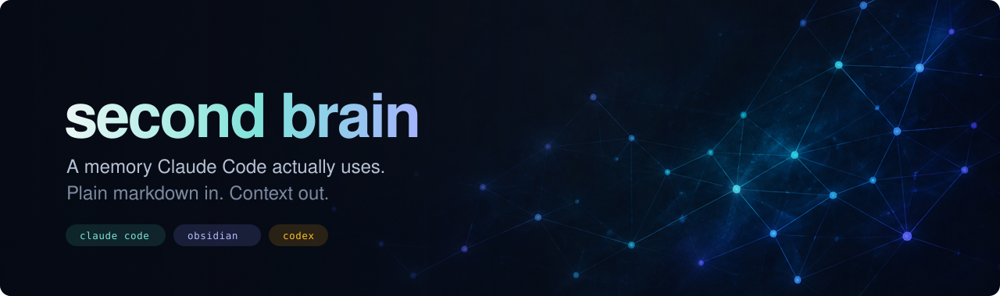
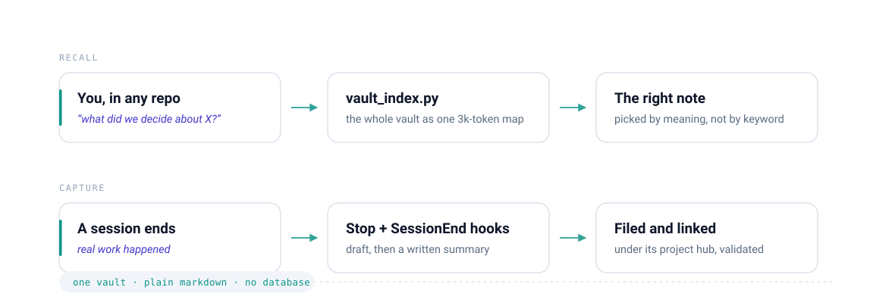
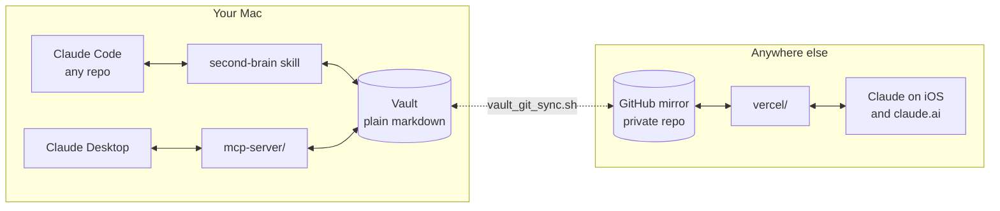

<div align="center">



<br>


**A Claude Code skill that turns a folder of markdown into a memory Claude actually uses.**

Ask *"what did we decide about X?"* in any repo and it finds the note. End a real
work session and it writes the summary itself, files it under the right project,
and links it back.

</div>

---

## The shape of it

<picture>
  <source media="(prefers-color-scheme: dark)" srcset="assets/flow-dark.svg">
  <source media="(prefers-color-scheme: light)" srcset="assets/flow-light.svg">
  
</picture>

It is plain markdown all the way down. Obsidian on top is optional, nice for the
graph view and mobile editing, but nothing here depends on it.

<br>

## What you get

<table>
<tr>
<td width="33%" valign="top">

### 🧠 &nbsp;Tier 1
**The vault and the skill**

Claude searches your notes by *meaning* rather than keyword, loads a project's
history when you open its repo, and files new notes correctly.

`~10 min` · most of the value

</td>
<td width="33%" valign="top">

### ⚙️ &nbsp;Tier 2
**Hooks**

Sessions save themselves. A draft updates every turn; at session end Claude
promotes it to a real summary, links it to its hub, validates the frontmatter.

`~5 min` · you do nothing

</td>
<td width="33%" valign="top">

### 📱 &nbsp;Tier 3
**Phone and web**

The vault mirrors to a private GitHub repo and a small Vercel app serves it to
Claude on iOS and claude.ai.

`~30 min` · optional, fiddliest

</td>
</tr>
</table>

## Requirements

| | |
|---|---|
| **Always** | macOS · Python 3.12+ · git · [Claude Code](https://claude.com/claude-code) |
| **Tier 2** | `jq` (`brew install jq`) |
| **Tier 3** | a GitHub account · a free Vercel account |
| **Optional** | [Obsidian](https://obsidian.md) · `uv` for the Claude Desktop server |

---

# Tier 1 · vault and skill

```bash
git clone https://github.com/Dressi123/second-brain-skill.git ~/.claude/skills/second-brain
cd ~/.claude/skills/second-brain
./bootstrap.sh
```

`bootstrap.sh` **is** the setup. It writes `.bootstrap.conf` with your vault
path and creates the folders and templates the helpers expect to find. Nothing
tracked is modified, so `git status` stays clean and `git pull` keeps working.

> [!TIP]
> Safe to run again any time, and `--dry-run` shows what it would touch first.

By default the vault goes to the iCloud Obsidian location
(`~/Library/Mobile Documents/iCloud~md~obsidian/Documents/<vault>`). Anywhere else
is fine:

```bash
./bootstrap.sh --vault ~/Documents/Brain
```

It finishes by running the vault index, which is the real smoke test. A header and
no traceback means the skill works. Then make your first hub:

```bash
python3 ~/.claude/skills/second-brain/helpers/new_hub.py \
  --type project --id my-app --name "My App" --description "What it is, in a sentence."
```

Open Claude Code anywhere and ask **"what's in my second brain?"**. It should read
`SKILL.md`, run the index, and tell you about `my-app`.

### Tell your agent the vault exists

**Do this. It is not optional polish.** Without it the skill only fires when you
name it. With it, Claude opens a repo and loads that project's history on its
own, and offers to write the summary at the end.

Add to `~/.claude/CLAUDE.md` (create the file if it isn't there):

```markdown
## The second brain

I keep a personal knowledge base at `<your vault path>`, in plain markdown.
Use the **`second-brain` skill** at `~/.claude/skills/second-brain/` for all
vault operations: saving session summaries, loading project context at session
start, creating hubs, and answering "what did we figure out about X?".
Invoke it at session start in a real project directory, when I mention the
vault, and at the end of a session where real work happened.
```

<details>
<summary><b>Using Codex too?</b> The same pointer for <code>~/.codex/AGENTS.md</code></summary>

<br>

Symlink the skill so there is still only one copy, then give Codex its own
pointer:

```bash
mkdir -p ~/.codex/skills
ln -s ~/.claude/skills/second-brain ~/.codex/skills/second-brain
```

```markdown
## The second brain

I keep a personal knowledge base at `<your vault path>`, in plain markdown.
Use the **`second-brain` skill** at `~/.codex/skills/second-brain/`: start with
`helpers/vault_index.py` and pick notes by meaning, never trust a hardcoded hub
list, and read `SKILL.md` there for the full conventions.

Codex has no session hooks, so when a session produced real work, **offer** to
save a summary and follow the "save session summary" operation in `SKILL.md`.
Do not attach the `*_hook.sh` scripts to Codex, since they invoke the Claude CLI.
```

Reads are safe to do directly; ask before a vault write if the sandbox does not
already allow it.

</details>

### Keeping it up to date

```bash
cd ~/.claude/skills/second-brain && git pull
```

Your vault path lives in `.bootstrap.conf`, which git ignores, so a pull never
touches it and there is nothing to re-apply.

### How the vault is organised

```
Projects/<Display Name>.md        one hub per active project
Notes/Topics/<Display Name>.md    thematic hubs (things that aren't projects)
Claude Archive/Sessions/          session summaries land here
Templates/                        the session-summary template lives here
Inbox/                            quick captures awaiting triage
Notes/, Daily/                    everything else
```

Every note carries frontmatter naming exactly one hub (`project: my-app` or
`topic: some-topic`) plus matching tags, and links back to its hub with a
wikilink. That is what makes the index work. `SKILL.md` documents the rules and
Claude follows them, so you rarely write frontmatter by hand.

The scripts under `helpers/` are the API. `vault_index.py` prints the whole vault
as a ~3k-token map, which is how Claude finds things; `search_notes.py` is
literal-match drill-down for when you already know the phrasing.

> [!NOTE]
> Reaching for search first is how you conclude something isn't in the vault when
> it is. `SKILL.md` says so at length, because it was learned the hard way.

---

# Tier 2 · sessions save themselves

Merge this into `~/.claude/settings.json`. `bootstrap.sh` prints the same block
with your paths already filled in, so copy it from there rather than editing by hand:

```jsonc
{
  "permissions": {
    "additionalDirectories": ["<your vault path>"]
  },
  "hooks": {
    "SessionStart": [{ "hooks": [{ "type": "command",
      "command": "bash ~/.claude/skills/second-brain/helpers/session_start_inbox_check.sh",
      "timeout": 15 }] }],
    "Stop": [{ "hooks": [{ "type": "command",
      "command": "bash ~/.claude/skills/second-brain/helpers/session_stop_draft_hook.sh",
      "timeout": 120, "async": true }] }],
    "SessionEnd": [{ "hooks": [{ "type": "command",
      "command": "bash ~/.claude/skills/second-brain/helpers/session_end_finalize_hook.sh",
      "timeout": 900, "async": true }] }]
  }
}
```

What each one costs, honestly:

| Hook | Does | Cost |
|---|---|---|
| `SessionStart` | shows a one-line vault status (inbox, dashboard age, matching hub) and has Claude's first reply ask what to act on | negligible |
| `Stop` | rewrites a draft summary at `Sessions/.drafts/<id>.md` after every turn | async, but a Claude call per turn |
| `SessionEnd` | promotes the draft to a real summary, links the hub, validates | async, up to 900 s |

`SessionEnd` decides for itself whether a session was worth saving, so quick
lookups don't litter the vault.

> [!IMPORTANT]
> There is a fourth hook, `vault_pretool_pull_hook.sh` on `PreToolUse`, that keeps
> the vault in sync with GitHub around every read and write. **Only add it if you
> do Tier 3**, since without a mirror it has nothing to sync.

```jsonc
"PreToolUse": [{ "matcher": "Read|Write|Edit|Bash", "hooks": [{ "type": "command",
  "command": "bash ~/.claude/skills/second-brain/helpers/vault_pretool_pull_hook.sh",
  "timeout": 20 }] }]
```

It fires on every Read/Write/Edit/Bash call but exits in milliseconds unless the
path actually points at the vault, so the cost is a `jq` call per tool use.

### Checking the hooks are alive

```bash
python3 ~/.claude/skills/second-brain/helpers/brain_status.py
```

Builds an HTML dashboard and opens it. Read the **Session drafts** panel:

| Row | Means |
|---|---|
| 🟢 `active` | a session in flight, live proof the Stop hook works |
| ⚪ `stale` | finalize never ran, and the file stopped changing >2 h ago |
| 🔴 `crashed` | finalize was invoked but never finished |
| 🟡 `orphaned` | finalize completed, yet the draft is still on disk |

Anything but `active` is a leftover. Nothing sweeps `.drafts/`, so delete those
once you've confirmed the work got captured. `helpers/session_hooks.log` has the
raw trail.

---

# Tier 3 · phone and web

Two moving parts: the vault mirrors to a **private** GitHub repo, and a small
Vercel app serves that repo to Claude as an MCP connector.

### 1 · Mirror the vault to GitHub

Create an empty **private** repo (e.g. `second-brain-vault`). The git directory
deliberately lives *outside* the vault, at `~/.second-brain-git`, so Obsidian and
iCloud never see a `.git/` folder:

```bash
VAULT="$HOME/Library/Mobile Documents/iCloud~md~obsidian/Documents/MyVault"  # yours
git init --bare -b main ~/.second-brain-git   # -b main, or the first push fails
git --git-dir=$HOME/.second-brain-git --work-tree="$VAULT" remote add origin \
  https://github.com/<you>/second-brain-vault.git
git --git-dir=$HOME/.second-brain-git --work-tree="$VAULT" add -A
git --git-dir=$HOME/.second-brain-git --work-tree="$VAULT" commit -m "initial vault"
git --git-dir=$HOME/.second-brain-git --work-tree="$VAULT" push -u origin main
```

Put a `.gitignore` in the vault root excluding `.DS_Store`,
`.obsidian/workspace*.json` and binaries (`*.png`, `*.pdf`, `Attachments/`, …).
Markdown-only is what keeps git a sane sync backend.

From then on `helpers/vault_git_sync.sh pull|push|sync` is the bridge, and the
PreToolUse hook calls it for you.

> [!NOTE]
> It is deliberately **not** a launchd timer: macOS denies background agents
> access to `~/Library/Mobile Documents`, so a timer gets "Operation not
> permitted" on every file. It runs from processes that already have vault access
> instead.

### 2 · Deploy the connector

[`vercel/README.md`](vercel/README.md) has the full deploy and it is accurate, so
follow it. Two things it assumes you have already done:

- **Step 1 above exists.** The app reads the vault *from GitHub*, not from your Mac.
- **`VAULT_REPO` points at your repo.**

> [!WARNING]
> `VAULT_REPO` has no default. Set it, or the deploy fails on its first request
> with an error that looks like a token problem.

You'll need a fine-grained GitHub PAT with Contents read+write scoped to that one
repo. **Not** `gh auth token`, which carries far broader scopes. Then add
`<your-vercel-url>/mcp` as a connector in Claude's settings.

Once it's up, `capture_note` from your phone drops a note into `Inbox/`, and the
next Claude Code session on your Mac offers to file it.

---

## The two MCP servers

Both ship here, and both expose the same six tools: `vault_index`, `search_notes`,
`list_taxonomy`, `read_note`, `capture_note`, `write_note`. They are independent,
so set up either, both, or neither.

| | 🖥️ &nbsp;`mcp-server/` | ☁️ &nbsp;`vercel/` |
|---|---|---|
| **For** | Claude Desktop on the Mac | Claude on iOS and claude.ai |
| **Transport** | stdio, local only | HTTPS + OAuth |
| **Reads the vault from** | disk, directly | the GitHub mirror |
| **Needs** | `uv` | GitHub repo + Vercel account |
| **Setup** | below, ~2 minutes | Tier 3 above |



> [!NOTE]
> **Claude Code needs neither.** The skill reads the vault off disk itself, which
> is always faster and never a sync behind. `SKILL.md` tells Claude to ignore the
> remote tools when running locally.

### Claude Desktop (local, stdio)

Install [`uv`](https://docs.astral.sh/uv/) if you don't have it (`brew install uv`),
then add this to `~/Library/Application Support/Claude/claude_desktop_config.json`:

```json
{
  "mcpServers": {
    "second-brain": {
      "command": "/opt/homebrew/bin/uv",
      "args": ["run", "--directory",
               "/Users/<you>/.claude/skills/second-brain/mcp-server", "server.py"]
    }
  }
}
```

> [!WARNING]
> Absolute paths in **both** fields. Claude Desktop doesn't launch with your
> shell's `PATH`, so a bare `uv` is the usual reason a server shows up red.
> `command -v uv` gives you the right one.

`uv` reads `pyproject.toml` and `uv.lock` in that directory and builds the
environment on first launch; there is nothing to install by hand. Verify it
without opening the app:

```bash
printf '{"jsonrpc":"2.0","id":1,"method":"initialize","params":{"protocolVersion":"2025-06-18","capabilities":{},"clientInfo":{"name":"probe","version":"1"}}}\n' \
  | uv run --directory ~/.claude/skills/second-brain/mcp-server server.py
```

A JSON result naming your vault means it works. Then restart Claude Desktop.

This one is **read/write**. `capture_note` and `write_note` are exposed, which is
fine for a server only something already on your Mac can launch.

---

## Troubleshooting

<details>
<summary><b>Hooks silently do nothing</b></summary>

<br>

They shell out to the `claude` binary, found on your `PATH`. Confirm
`command -v claude` returns something, and that `jq` is installed.

</details>

<details>
<summary><b>A helper can't find the vault</b></summary>

<br>

Everything reads it from `.bootstrap.conf`, which `bootstrap.sh` writes. Python
goes through `helpers/vault_paths.py` and the shell hooks through
`helpers/vault_config.sh`, and both let `SECOND_BRAIN_VAULT` in your environment
win. Run `python3 helpers/vault_paths.py` to print what they actually resolve to.

If the clone is **not** at `~/.claude/skills/second-brain`, the MCP servers also
need `SECOND_BRAIN_HELPERS=<clone>/helpers`. `bootstrap.sh` warns about this.

</details>

<details>
<summary><b>Claude ignores the skill</b></summary>

<br>

Confirm it's at `~/.claude/skills/second-brain/` with a readable `SKILL.md`. The
frontmatter description is what Claude matches against, so check it is intact.
Then make sure you added the pointer to `~/.claude/CLAUDE.md` described above.

</details>

<details>
<summary><b>Sync stops</b></summary>

<br>

`vault_git_sync.sh` refuses to touch a repo left mid-rebase or mid-merge, by
design. Check `~/.second-brain-git/sync.log`, resolve by hand, and it resumes.

</details>

---

## Layout

```
SKILL.md            the instructions Claude reads, the actual product
bootstrap.sh        makes this clone yours
helpers/            vault_index · search_notes · list_taxonomy · validate
                    new_hub · add_session_to_hub · brain_status
                    vault_git_sync + the four session hooks
mcp-server/         stdio MCP server for Claude Desktop (local disk)
vercel/             hosted MCP server for iOS and web (reads the GitHub mirror)
agents/             Codex agent card
assets/             hero, flow diagram, social card
```

`SKILL.md` is worth reading start to finish even if you never touch the code. It
is the design document as much as the instructions, and most of it exists because
something went wrong first.

## A note on forking

This is one person's setup, shared because it works, not a product. The
conventions in `SKILL.md` (hub IDs, the frontmatter shape, "neither a keyword
search nor a guess") are opinions that earned their place. Change them if yours
differ, but change them in `SKILL.md`, which is the one file everything else
follows.

The vault repo referenced in `vercel/` is private personal notes. Make your own.

<div align="center">
<br>
<sub><b>second brain</b> · plain markdown in, context out</sub>
</div>
